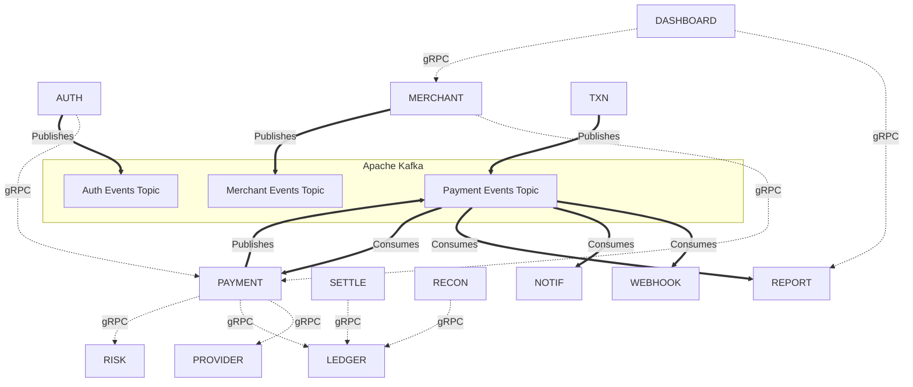
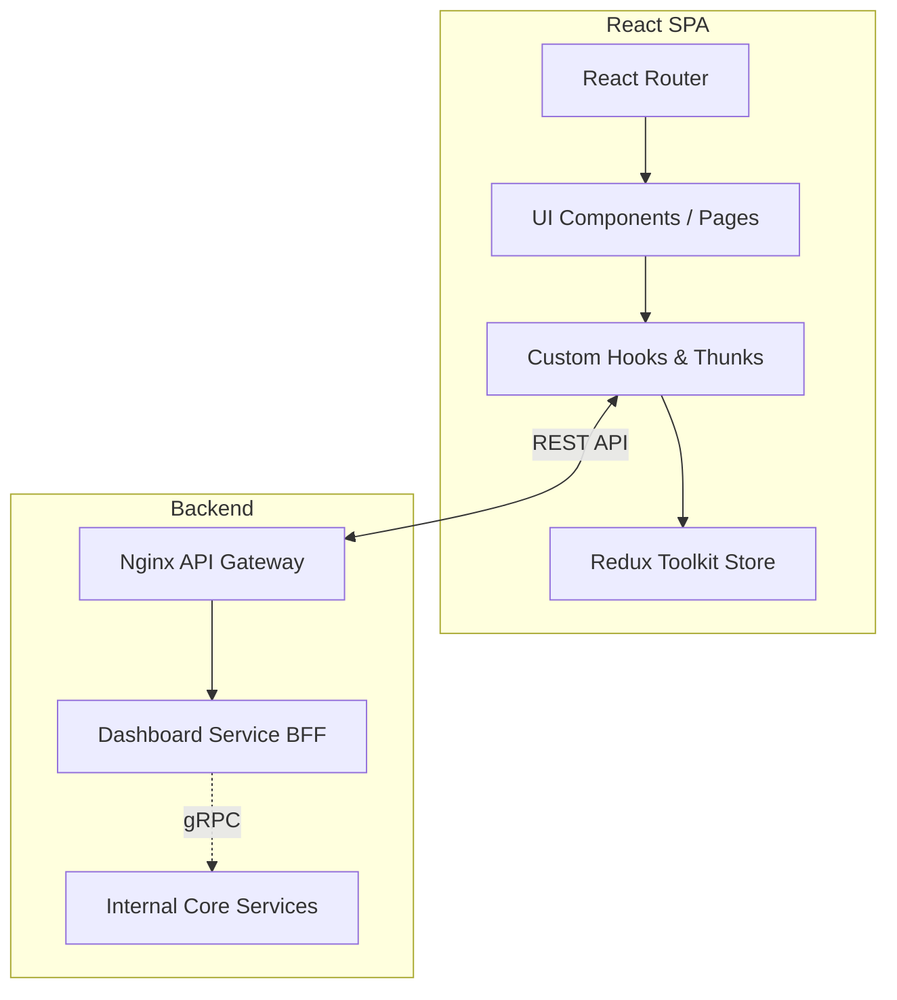

# Enterprise Payment Gateway


An enterprise-grade, highly resilient payment gateway designed for high-throughput financial transactions. This system is built on a polyglot microservice architecture featuring strictly consistent double-entry accounting, Zero-Trust network security, and asynchronous Kafka-based state orchestration to protect against external provider unreliability.

---

## 🏗 System Architecture Overview

The system is composed of **20 isolated microservices** routed through an Nginx Gateway. It is split into three technology stacks based on operational requirements: **Go** for high-performance financial core logic, **TypeScript/Express** for business management, and **Python** for machine learning inference.

```mermaid
flowchart TD
    CLIENTS[Clients / Merchants]
    GATEWAY[Nginx API Gateway]
    
    CLIENTS --> GATEWAY

    subgraph TS_Services ["Express/TypeScript Services (Business Layer)"]
        AUTH[Auth Service]
        MERCHANT[Merchant Service]
        ADMIN[Admin Service]
        DASHBOARD[Dashboard BFF]
        NOTIF[Notification Service]
        REPORT[Reporting Service]
        COMPLIANCE[Compliance Worker]
    end

    subgraph Go_Services ["Go Services (Financial Core)"]
        PAYMENT[Payment Service]
        PROVIDER[Provider Service]
        LEDGER[Ledger Service]
        TXN[Transaction Service]
        WEBHOOK[Webhook Service]
        RECON[Reconciliation Service]
        SETTLE[Settlement Service]
        RISK[Risk Service]
        ROUTING[Routing Service]
        PRICING[Pricing Service]
        DISPUTE[Dispute Service]
        FX[FX Service]
    end

    subgraph Python_Services ["Python Services (ML Layer)"]
        ML[Risk ML Worker]
    end

    GATEWAY --> AUTH
    GATEWAY --> MERCHANT
    GATEWAY --> PAYMENT
    GATEWAY --> TXN
    GATEWAY --> DASHBOARD
    GATEWAY --> ADMIN

    %% External Systems
    PROVIDER_EXT[External Providers e.g. Telebirr, CBE]
    PROVIDER <-->|API Calls| PROVIDER_EXT
    PROVIDER_EXT -->|Async Webhooks| TXN
```



### Technology Stack
*   **API Gateway**: Nginx 
*   **Business Services**: Node.js, Express, TypeScript, Prisma ORM
*   **Financial Core**: Go, gRPC, GORM
*   **Machine Learning**: Python, FastAPI/gRPC, scikit-learn
*   **Databases**: PostgreSQL (Microservice Database-per-service pattern)
*   **Message Broker**: Apache Kafka (Event-driven architecture & Outbox pattern)
*   **Caching**: Redis
*   **Observability**: OpenTelemetry, Prometheus, Grafana

---

## 🔄 Service-to-Service Communication

The gateway relies on two distinct communication patterns:
1.  **Synchronous (gRPC)**: For operations requiring immediate consistency (e.g., deducting limits, writing to the Ledger, checking risk rules).
2.  **Asynchronous (Kafka)**: For event broadcasting, long-running processes, and orchestrator loops.



---

## 💾 Database Architecture (Isolated Micro-Databases)

The system utilizes 20 isolated PostgreSQL schemas. **Each service completely owns its data** and no cross-database JOINs are permitted. Data replication and references are handled logically.

```mermaid
erDiagram
    "AUTH_DB" ||--o{ "Users" : manages
    "AUTH_DB" ||--o{ "Roles (RBAC)" : manages
    "AUTH_DB" ||--o{ "AuditLogs" : manages

    "MERCHANT_DB" ||--o{ "Merchants" : manages
    "MERCHANT_DB" ||--o{ "ApiKeys" : manages
    "MERCHANT_DB" ||--o{ "Limits & Prefs" : manages

    "PAYMENT_DB" ||--o{ "Payments" : manages
    "PAYMENT_DB" ||--o{ "Refunds" : manages
    "PAYMENT_DB" ||--o{ "PaymentStateHistory" : manages

    "LEDGER_DB" ||--o{ "JournalEntries" : manages
    "LEDGER_DB" ||--o{ "JournalLines" : manages
    "LEDGER_DB" ||--o{ "Accounts" : manages

    "TRANSACTION_DB" ||--o{ "ProviderWebhooks" : handles

    "WEBHOOK_DB" ||--o{ "Deliveries" : dispatches
    "WEBHOOK_DB" ||--o{ "Attempts" : tracks

    "ADMIN_DB" ||--o{ "PaymentProviders" : registers
    
    "RISK_DB" ||--o{ "FraudRules" : enforces
    "COMPLIANCE_DB" ||--o{ "KYC_Records" : tracks
    "PRICING_DB" ||--o{ "FeeSchedules" : calculates
    "ROUTING_DB" ||--o{ "RoutingRules" : determines
    "DISPUTE_DB" ||--o{ "Chargebacks" : manages
    "FX_DB" ||--o{ "ExchangeRates" : converts
```



### Key Schemas Detailed:
*   **`payment_db`**: Owns financial intent. Uses Optimistic Concurrency Control (OCC). Contains `Payments`, `Refunds`, `PaymentStateHistory`, and `IdempotencyKeys`.
*   **`ledger_db`**: The ultimate source of truth. Uses immutable **Double-Entry Accounting**. Entries can never be deleted or modified, only reversed.
*   **`merchant_db`**: Contains `Merchants`, `ApiKeys` (hashed), `WebhookConfigs`, `ProviderConfigs`, and detailed `MerchantPreferences` and `MerchantPaymentMethods`.
*   **`auth_db`**: Contains `Users`, `Credentials` (hashed), `Roles` (RBAC), and system-wide `AuditLogs`.
*   **`webhook_db`**: Handles outgoing webhooks to merchants. Uses `Deliveries` and `Attempts` tables to track exponential backoff and retries.

---

## 🛡 Security & Zero-Trust (mTLS & SPIFFE)

The system assumes the internal network is compromised and operates on a strict **Zero-Trust** model.
*   **mTLS Everywhere**: Every internal gRPC and Kafka connection requires a valid X.509 client certificate.
*   **SPIFFE Identity**: Certificates embed the service's identity in the Subject Alternative Name (e.g., `spiffe://payment-gateway/ns/production/sa/payment-service`).
*   **gRPC Authorization Matrix**: A universal `UnaryServerInterceptor` blocks requests (with `PERMISSION_DENIED`) if the calling service is not explicitly allowed to execute a specific RPC method. For example, `reporting-service` cannot spoof a call to the `ledger-service`.
*   **Kafka ACLs**: Services can only publish/consume from topics they are cryptographically authorized to access.
*   **Context Anti-Spoofing**: Enforced checks to ensure a compromised service cannot impersonate another service's identity in logs or tracing contexts.

---

## ⚙️ Core Engineering Principles

### 1. No Silent Fallbacks (Explicit State Modeling)
Payments do not simply transition from `PENDING -> COMPLETED`. External networks fail. The system explicitly models uncertainty:
*   `UNKNOWN`: Provider timed out. Requires manual/automated reconciliation.
*   `COMPLETION_PENDING`: Provider succeeded, but the internal Ledger failed to post.
Every single transition is permanently appended to `payment_state_history` to ensure a perfect audit trail.

### 2. The Asynchronous Orchestrator Loop
To protect the system from out-of-order webhooks and provider unreliability:
1.  **Payment Service** initiates a payment, saves state as `PENDING`, and halts.
2.  **Transaction Service** (exclusively) receives the async webhook from the provider (e.g., Telebirr/M-Pesa), deduplicates it using Postgres `UNIQUE` constraints, and publishes an Outbox event to Kafka.
3.  **Payment Service** consumes the Kafka event, records the final `JournalEntry` to the Ledger, and updates the payment to `SUCCEEDED`.

### 3. Exactly-Once Processing (Idempotency)
All external-facing APIs and internal message consumers utilize strict Idempotency Keys and `ProcessedEvent` tables to ensure network retries never result in double-charging or double-crediting.

---

## 👥 Roles & Access Control

The `auth-service` manages a full Role-Based Access Control (RBAC) system:
*   `SUPER_ADMIN`: Global system administration.
*   `MERCHANT_OWNER`: Full access to a specific merchant's organization.
*   `MERCHANT_DEVELOPER`: Access to API keys and webhook logs.
*   `MERCHANT_FINANCE`: Access to reporting, balances, and reconciliation.

**API Authentication**: 
Incoming requests to the Payment Gateway require either a `SECRET` key (backend-to-backend) or a `PUBLISHABLE` key (frontend/checkout).

---

## 🚀 Key Endpoints (High-Level)

### Payment API
*   `POST /v1/payments` - Initiate a payment (Idempotent)
*   `GET /v1/payments/:id` - Check payment status
*   `POST /v1/payments/:id/refund` - Initiate a partial/full refund

### Merchant API 
*   `POST /v1/merchants/api-keys` - Generate a new secret key
*   `POST /v1/merchants/webhooks` - Configure webhook endpoints
*   `PATCH /v1/merchants/preferences` - Update routing and fee settings

### Webhook & Event Dispatch
*   **Ingestion**: External providers send data to `/v1/transactions/callback/:provider`
*   **Dispatch**: `webhook-service` pushes securely to the Merchant's configured endpoints.

### Internal RPCs (gRPC Only)
*   `ledger.LedgerService/RecordJournalEntry`
*   `provider.ProviderService/InitiatePayment`
*   `risk.RiskService/EvaluateRisk`

---

## 💻 Frontend Architecture (Dashboard)

The Merchant Dashboard is a Single Page Application (SPA) built to provide merchants with real-time insights, configuration management, and payment tracking. 

### Technology Stack
*   **Core**: React 19, TypeScript, Vite
*   **State Management**: Redux Toolkit (`@reduxjs/toolkit`)
*   **Routing**: React Router DOM
*   **Styling**: Pure/Vanilla CSS with `classnames`
*   **Icons**: Lucide React

### State & Data Flow

The frontend relies on a strictly unidirectional data flow. API requests are routed through the backend's Nginx Gateway, hitting the `dashboard-service` (BFF - Backend for Frontend), which acts as an aggregator for the internal microservices.



### Directory Structure (Feature-Sliced)

The codebase is organized into domain-driven feature modules and shared layers to ensure scalability as the dashboard grows:

```text
src/
 ├── components/  # Shared/reusable UI components (Buttons, Modals, Tables)
 ├── features/    # Domain-specific logic and isolated components (e.g., Auth, Payments)
 ├── pages/       # Route-level components mapping to views
 ├── layouts/     # Structural layouts (Sidebar, Header, Main Content area)
 ├── store/       # Redux Toolkit store configuration, slices, and selectors
 ├── services/    # API integration and data fetching logic
 ├── hooks/       # Custom React hooks (e.g., useAuth)
 └── utils/       # Helper functions and formatters (e.g., date-fns)
```

---

## ☁️ Infrastructure & Deployment

The platform is designed to run seamlessly both locally for developers and in a highly available AWS cloud architecture for production.

### Local Development (Docker Compose)
For local development, the entire microservice ecosystem and its dependencies are orchestrated via `docker-compose.yml`. Running `make dev` starts the backend services and provisions mock versions of the production infrastructure:
*   **PostgreSQL**: A single container hosts 20 isolated schemas, simulating a micro-database-per-service pattern.
*   **Apache Kafka**: A local Zookeeper/Kafka broker is initialized with pre-configured topics (`payment.events`, `merchant.events`, `ledger.events`).
*   **Redis**: Used universally by the microservices for configuration caching and enforcing strict Idempotency Keys across payment flows.
*   **MailHog**: Traps all outbound SMTP emails sent by the `notification-service`.
*   **Dozzle/Prometheus/Jaeger**: Local observability stack for log aggregation, tracing, and metrics.

### Production (Terraform on AWS)
Production infrastructure is declared strictly as Infrastructure-as-Code (IaC) using Terraform located in `infra/terraform/`. These definitions map local development concepts to managed AWS cloud-native resources:
*   `rds.tf`: Provisions Amazon Aurora PostgreSQL clusters instead of a single instance, ensuring high availability for the partitioned Ledger and critical financial data.
*   `elasticache.tf`: Provisions Amazon ElastiCache for Redis to handle distributed idempotency checks across thousands of concurrent payment orchestrator nodes.
*   `msk.tf`: Deploys Amazon Managed Streaming for Apache Kafka (MSK) to provide a resilient, multi-AZ event bus for asynchronous webhooks and outbox pattern delivery.
*   `vpc.tf` & `route53.tf`: Defines private subnets, NAT gateways, and DNS routing to enforce Zero-Trust network boundaries between the public-facing Nginx Gateway and the internal microservices.

**Note:** Terraform state is managed remotely (e.g., via S3/DynamoDB) and executed via CI/CD pipelines. No `.terraform` state files are committed or executed locally.
