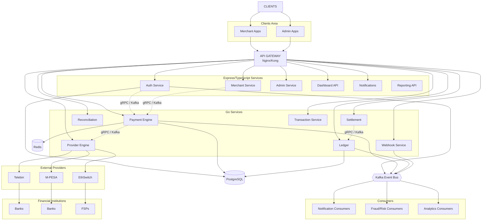

# System Architecture

## High-Level Architecture

## Language Split

| Area | Language | Why |
|---|---|---|
| Payment engine | **Go** | concurrency, performance, financial core |
| Provider engine | **Go** | external integrations + resilient I/O |
| Ledger | **Go** | correctness + transactional processing |
| Reconciliation | **Go** | large transaction processing |
| Settlement | **Go** | financial processing |
| Webhooks | **Go** | high-throughput callbacks |
| Transaction | **Go** | state management |
| Auth | **Express + TS** | business/API layer |
| Merchant | **Express + TS** | CRUD/business management |
| Admin | **Express + TS** | management API |
| Dashboard API | **Express + TS** | frontend-oriented APIs |
| Notifications | **Express + TS** | simpler integration |
| Reporting API | **Express + TS** | data aggregation |
| Event bus | **Kafka** | async communication |
| Internal RPC | **gRPC** | synchronous service communication |
| Primary DB | **PostgreSQL** | transactional source of truth |
| Cache/limits | **Redis** | non-authoritative fast state |
| Observability | **Prometheus + Grafana + OpenTelemetry** | metrics/tracing |
