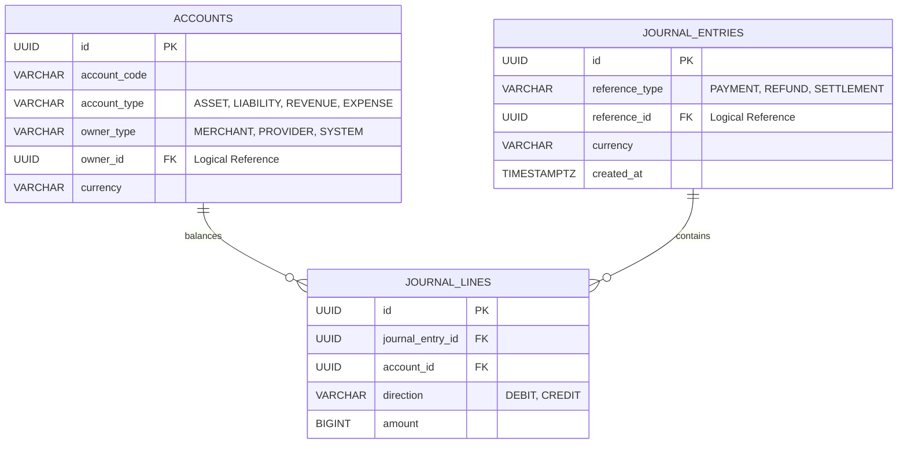

# Ledger Service ERD

This represents the internal tables of the `ledger_db`.

```mermaid
erDiagram
    ACCOUNTS {
        UUID id PK
        VARCHAR account_code
        VARCHAR account_type "ASSET, LIABILITY, REVENUE, EXPENSE"
        VARCHAR owner_type "MERCHANT, PROVIDER, SYSTEM"
        UUID owner_id FK "Logical Reference"
        VARCHAR currency
    }

    JOURNAL_ENTRIES {
        UUID id PK
        VARCHAR reference_type "PAYMENT, REFUND, SETTLEMENT"
        UUID reference_id FK "Logical Reference"
        VARCHAR currency
        TIMESTAMPTZ created_at
    }

    JOURNAL_LINES {
        UUID id PK
        UUID journal_entry_id FK
        UUID account_id FK
        VARCHAR direction "DEBIT, CREDIT"
        BIGINT amount
    }

    ACCOUNTS ||--o{ JOURNAL_LINES : balances
    JOURNAL_ENTRIES ||--o{ JOURNAL_LINES : contains
```
