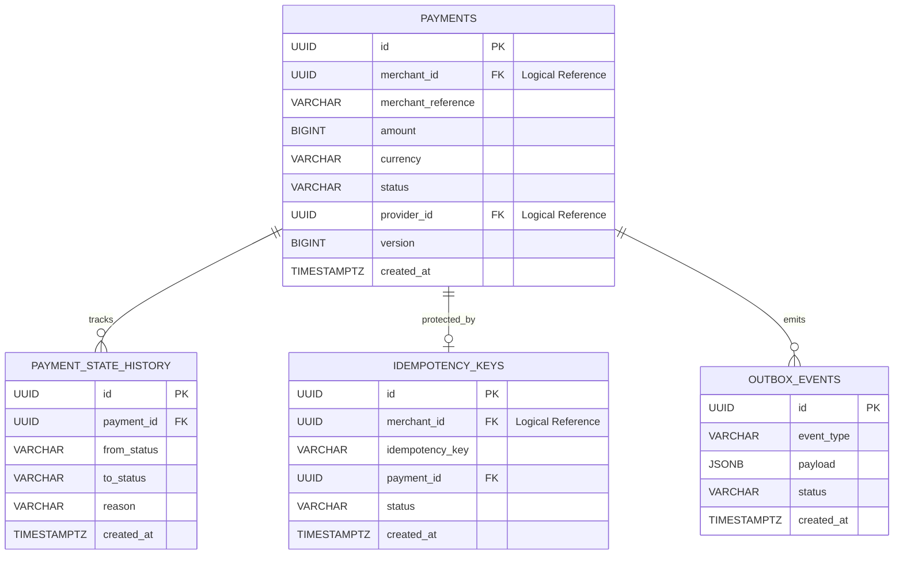

# Payment Service ERD

This represents the internal tables of the `payment_db`.

```mermaid
erDiagram
    PAYMENTS {
        UUID id PK
        UUID merchant_id FK "Logical Reference"
        VARCHAR merchant_reference
        BIGINT amount
        VARCHAR currency
        VARCHAR status
        UUID provider_id FK "Logical Reference"
        BIGINT version
        TIMESTAMPTZ created_at
    }

    PAYMENT_STATE_HISTORY {
        UUID id PK
        UUID payment_id FK
        VARCHAR from_status
        VARCHAR to_status
        VARCHAR reason
        TIMESTAMPTZ created_at
    }

    IDEMPOTENCY_KEYS {
        UUID id PK
        UUID merchant_id FK "Logical Reference"
        VARCHAR idempotency_key
        UUID payment_id FK
        VARCHAR status
        TIMESTAMPTZ created_at
    }

    OUTBOX_EVENTS {
        UUID id PK
        VARCHAR event_type
        JSONB payload
        VARCHAR status
        TIMESTAMPTZ created_at
    }

    PAYMENTS ||--o{ PAYMENT_STATE_HISTORY : tracks
    PAYMENTS ||--o| IDEMPOTENCY_KEYS : protected_by
    PAYMENTS ||--o{ OUTBOX_EVENTS : emits
```
