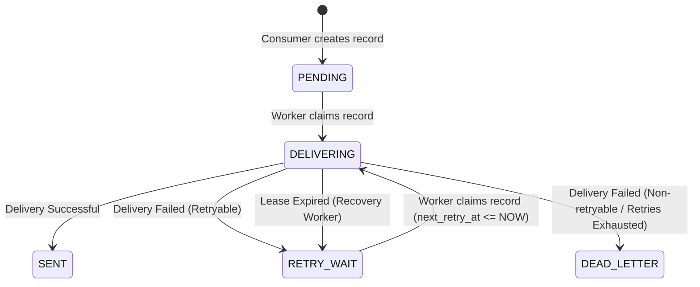

# Notification State Machine

The Notification Service utilizes a strict database-backed state machine to track the lifecycle of each notification payload.

## States

- **PENDING**: The notification has been created in the database and is awaiting a delivery worker to claim it.
- **DELIVERING**: A worker has claimed this notification using `FOR UPDATE SKIP LOCKED` and is currently attempting to dispatch it via the provider (e.g., SMTP or SMS API). A `lease_until` timestamp protects against concurrent execution and worker crashes.
- **SENT**: The notification was successfully dispatched and acknowledged by the provider. This is a terminal state.
- **RETRY_WAIT**: Dispatch failed with a retryable error (e.g., connection timeout). A `next_retry_at` timestamp determines when the worker will attempt delivery again using exponential backoff with jitter.
- **DEAD_LETTER**: The notification has permanently failed, either because the maximum number of retries (`NOTIFICATION_MAX_RETRIES`) was exhausted or a non-retryable error (e.g., malformed recipient address) occurred. This is a terminal state.

## State Transitions

## Concurrency Protection
To prevent duplicate deliveries across multiple replica instances, the Notification Service utilizes PostgreSQL's `FOR UPDATE SKIP LOCKED` for its background worker. This ensures that a `PENDING` or `RETRY_WAIT` record can only be claimed by exactly one active worker at a time.
