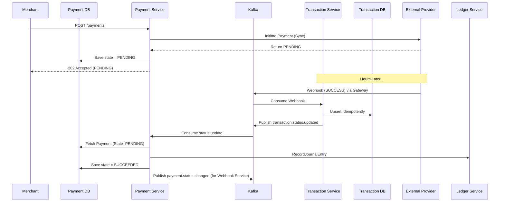

# The Payment/Transaction Async Orchestrator Loop

The relationship between the **Payment Service** and the **Transaction Service** forms a highly available, eventually-consistent loop designed to protect the core database from external unreliability (webhooks arriving out of order, duplicates, or missing entirely).

## 1. The Separation of Concerns
*   **Payment Service** owns the `payments` table. It is responsible for authorization, risk evaluation, talking to external providers synchronously, and ledger double-entry accounting.
*   **Transaction Service** owns the `transactions` table. It is responsible *solely* for tracking the lifecycle of the external provider's transaction (Telebirr/M-Pesa) and processing incoming async webhooks.

## 2. The Asynchronous Loop
When a payment requires an asynchronous callback (e.g., M-Pesa returns `PENDING`), the loop executes as follows:

### Step A: Payment Service (Initiation)
1. Payment Service attempts `provider.InitiatePayment()`.
2. Provider returns `PENDING`.
3. Payment Service transitions the payment to `PENDING` and commits to `payment_db`.
4. It *waits*. It does nothing else until Kafka tells it to wake up.

### Step B: Transaction Service (Webhook Ingestion)
1. The external provider hits the Gateway with a webhook payload.
2. The Gateway normalizes it and publishes `provider.normalized.event` to Kafka.
3. **Transaction Service** consumes this event.
4. **Idempotency Guard**: It attempts to `INSERT / UPDATE` the `transaction_db` using the `UNIQUE(provider_id, provider_transaction_id)` constraint.
   *   If it's a duplicate, it's ignored safely.
   *   If it's out of order (a PENDING webhook arriving after a SUCCESS webhook), it is discarded.
5. If the state progressed, the Transaction Service uses the **Outbox Pattern** to publish `transaction.status.updated` back to Kafka.

### Step C: Payment Service (Resolution)
1. The **Payment Service** consumes `transaction.status.updated` from Kafka.
2. It fetches the payment from `payment_db`.
3. If the payment is `PENDING` (or `UNKNOWN`), it evaluates the new status.
4. If `SUCCESS`, it immediately calls the **Ledger Service** to perform the double-entry accounting (`COMPLETION_PENDING`).
5. Once the ledger posts, it finalizes the payment to `SUCCEEDED` and publishes `payment.status.changed` via its own Outbox for the Merchant to be notified.

## 3. Unknown State Recovery
If the `provider.InitiatePayment()` call **times out** synchronously:
1. Payment Service assumes `UNKNOWN`.
2. The loop operates identically. When the Transaction Service eventually receives the webhook (either SUCCESS or FAILED), it emits the update.
3. The Payment Service receives it and safely transitions from `UNKNOWN -> SUCCEEDED` (via Ledger) or `UNKNOWN -> FAILED`. 
