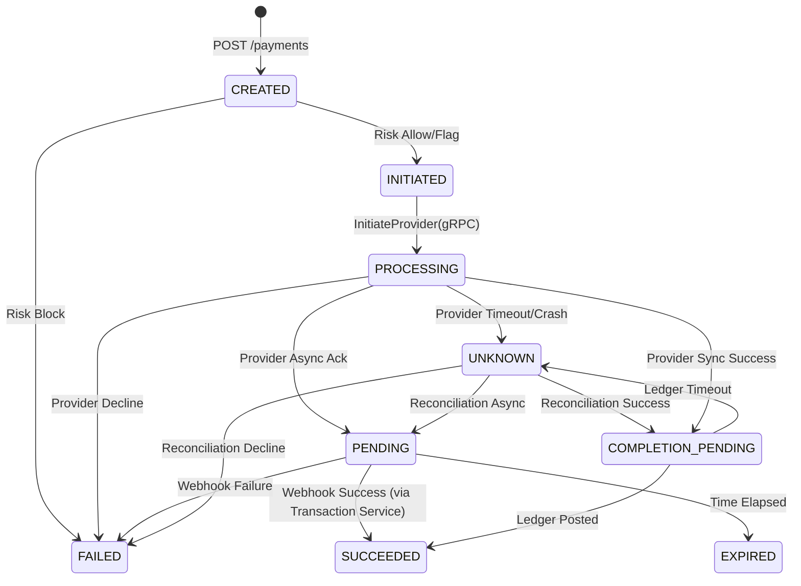

# Payment State Machine

The Payment Service is the authoritative owner of the payment state. Payments do not follow a simple `PENDING -> COMPLETED` flow. The system must explicitly model uncertainty.

## Defined States

| State | Description | Is Terminal? |
| :--- | :--- | :---: |
| `CREATED` | The initial intent is recorded after authentication but before risk evaluation. | ❌ |
| `INITIATED` | Risk evaluation passed. The payment is preparing to call the provider. | ❌ |
| `PROCESSING` | The call to the Provider Service is active. | ❌ |
| `PENDING` | The provider accepted the request asynchronously, but outcome is pending (e.g., waiting for webhook). | ❌ |
| `UNKNOWN` | A timeout or unhandled failure occurred while communicating with the Provider or Ledger. Explicit reconciliation is required. | ❌ |
| `COMPLETION_PENDING` | Provider reported SUCCESS, but Ledger posting failed or timed out. Retry is required. | ❌ |
| `SUCCEEDED` | Provider succeeded AND Ledger successfully posted. | ✅ |
| `FAILED` | Payment failed deterministically (e.g., Risk block, Provider decline). | ✅ |
| `CANCELLED` | Payment was intentionally cancelled before completion. | ✅ |
| `EXPIRED` | The `PENDING` window elapsed without a provider resolution. | ✅ |

## Valid State Transitions

## Immutable History
Every state transition must be recorded in `payment_state_history` before returning to the caller. This guarantees an immutable audit trail of what happened, exactly when, and the reason for the transition.
