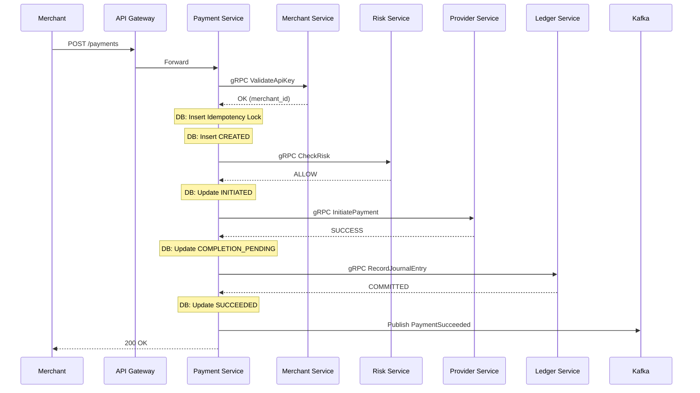

# Sequence Diagrams

## Synchronous Success Flow



## Provider Timeout & Recovery

```mermaid
sequenceDiagram
    participant Payment Service
    participant Provider Service
    participant Transaction Service
    participant Kafka

    Payment Service->>Provider Service: gRPC InitiatePayment
    Note over Provider Service: Context Deadline Exceeded
    Provider Service-->>Payment Service: TIMEOUT
    
    Note over Payment Service: DB: Update UNKNOWN
    Payment Service->>Kafka: Publish PaymentUnknown
    
    ... Time Passes ...
    
    Transaction Service->>Provider Service: Poll Status (Background)
    Provider Service-->>Transaction Service: SUCCESS
    
    Transaction Service->>Kafka: Publish TransactionUpdated (SUCCESS)
    Payment Service<<-Kafka: Consume TransactionUpdated
    
    Note over Payment Service: DB: Update COMPLETION_PENDING
    Payment Service->>Ledger Service: gRPC RecordJournalEntry
    Ledger Service-->>Payment Service: COMMITTED
    Note over Payment Service: DB: Update SUCCEEDED
```
