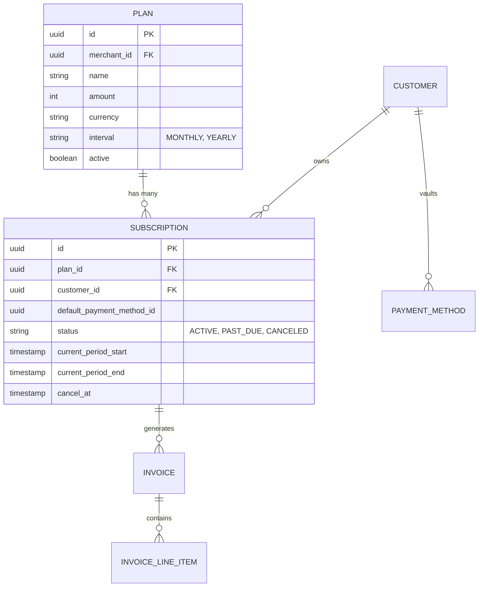
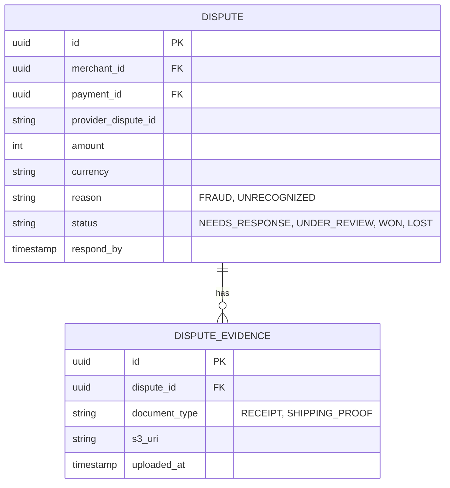
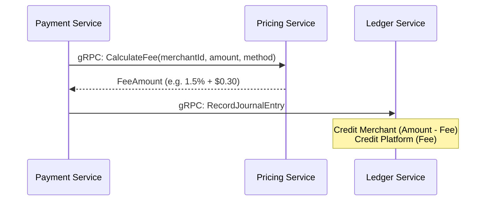

# V2 Enterprise Architecture Deep Dive

This document provides a low-level, technical blueprint of the databases, inter-service communications, and strict data contracts required to implement the V2 Enterprise features. Because we enforce a strict microservice architecture, foreign keys across services do not exist at the database level. Instead, we rely on bounded contexts, soft-linking (`merchant_id`, `payment_id`), and distributed orchestration.

---

## 1. Subscriptions & Billing Engine (`billing-service`)

The Billing Service is the autonomous heart of recurring revenue. It operates heavily on cron jobs and asynchronous Kafka event resolution to avoid blocking.

### Database Schema (PostgreSQL)



### S2S Communication (Service-to-Service)
- **Outbound gRPC (`payment-service`)**:
  - The internal billing cron worker queries `Subscriptions` where `current_period_end <= NOW()`.
  - For each, it generates an `Invoice` and executes `gRPC: CreatePayment` against the `payment-service`, passing the vaulted `PaymentMethod` token and setting `Idempotency-Key: invoice_<uuid>`.
- **Inbound Kafka (`payment.status.updated`)**:
  - The billing-service listens to Kafka. When a payment succeeds, it transitions the associated `Invoice` to `PAID` and bumps the `Subscription.current_period_end` by the plan interval.
  - If it fails, the `Invoice` transitions to `FAILED`, the `Subscription` goes to `PAST_DUE`, and a Dunning cycle (retry schedule) begins.

---

## 2. Disputes & Chargeback Management (`dispute-service`)

Disputes are highly sensitive because they directly impact the Ledger and Merchant available balances.

### Database Schema (PostgreSQL)



### S2S Communication (Service-to-Service)
- **Inbound Kafka (`provider.webhook.dispute`)**:
  - A new topic published by `provider-service` when Visa/Mastercard/Telebirr signals a chargeback.
- **Outbound gRPC (`ledger-service`)**:
  - Immediately upon creating the `Dispute` record, the service executes `gRPC: FreezeFunds(merchant_id, amount)`. The ledger moves funds from `AVAILABLE` to `FROZEN_DISPUTE`.
  - If `WON`: Executes `gRPC: ReleaseFrozenFunds`.
  - If `LOST`: Executes `gRPC: DebitFrozenFunds` (permanently resolving the chargeback loss).

---

## 3. KYC & AML Compliance Vault (`merchant-service`)

We do not create a new service for this; we extend the bounded context of the existing `merchant-service` to include business verification states.

### Database Extensions (Prisma)
```prisma
model KycProfile {
  id                 String   @id @default(uuid())
  merchantId         String   @unique
  businessName       String
  registrationNumber String?
  taxId              String?
  status             KycStatus @default(PENDING)
  documents          KycDocument[]
}

model KycDocument {
  id         String   @id @default(uuid())
  profileId  String
  type       DocType  // PASSPORT, BUSINESS_LICENSE
  s3Uri      String
  status     DocStatus // PENDING, VERIFIED, REJECTED
}
```

### S2S Communication (Service-to-Service)
- **Outbound Storage**: AWS S3. The merchant-service never serves binary files directly; it generates HTTP `Pre-Signed URLs` for the frontend to upload directly to S3.
- **Saga Orchestration Block**: The `payment-service` must check `merchant.KycStatus` via gRPC before allowing Live payments. If `PENDING`, all live payments are rejected.

---

## 4. Dynamic Pricing Engine (`pricing-service`)

Enterprise platforms cannot rely on hardcoded percentages. The pricing service evaluates rules dynamically.

### Orchestration Sequence



### Database Schema (PostgreSQL)
- **`PricingProfile`**: `id`, `merchant_id`, `currency`
- **`FeeRule`**: `id`, `profile_id`, `payment_method` (e.g. TELEBIRR), `percentage_cut` (e.g. 0.015), `fixed_cut` (e.g. 30 cents), `min_volume`, `max_volume`.

---

## 5. Advanced Fraud Radar (`risk-service`)

Currently, Risk Service uses rate limiting. The V2 upgrade implements synchronous, multi-vector rule evaluations.

### Evaluation Logic
When `payment-service` calls `gRPC: EvaluateRisk`, the `risk-service` executes:
1. **Velocity Check**: > 10 txns / minute?
2. **IP Blocklist**: Is `customer_ip` in `blocklisted_ips` table?
3. **Card BIN Blocklist**: Is the card's issuing bank restricted?
4. **Volume Anomaly**: Is the amount > 5x the merchant's historical average?

If the total risk score exceeds the merchant's configured threshold (e.g., `80/100`), it returns `Decision: REJECT`, throwing `ErrCodeRiskRejected` downstream.

---

## 6. Operational Resiliency Enhancements

### 3D Secure (3DS) / SCA Orchestration
- **Database Modification**: `payment-service` `Payment` state enum expanded to include `REQUIRES_ACTION`.
- **Flow**:
  1. Customer Submits Card.
  2. `payment-service` -> `provider-service` -> Bank.
  3. Bank replies "Needs OTP".
  4. `payment-service` transitions to `REQUIRES_ACTION` and returns the `redirect_url` to the Frontend.
  5. Customer completes OTP on bank site, bank redirects back to `dashboard-service` with a token.
  6. `dashboard-service` calls `POST /api/v1/payments/:id/capture` to finalize the state to `SUCCEEDED`.

### Idempotent Webhook Replay
- **Database Modification**: `webhook-service` `outgoing_webhook_deliveries` gets an optional `replay_of_delivery_id` column.
- **Logic**: When a Super Admin or Merchant clicks "Replay", the service creates a *new* delivery record identically copying the payload and target URL of the original, resetting `attempt_count` to 0, and immediately enqueueing it in the Dispatcher goroutine.

### Database Partitioning (Technical Debt Resolution)
To handle 100M+ rows per month in the `journal_lines` and `outgoing_webhook_deliveries` tables:
```sql
CREATE TABLE payments (
    id UUID NOT NULL,
    created_at TIMESTAMP NOT NULL,
    -- other fields
) PARTITION BY RANGE (created_at);

-- A background cron worker automatically executes:
CREATE TABLE payments_2026_11 PARTITION OF payments 
    FOR VALUES FROM ('2026-11-01') TO ('2026-12-01');
```
